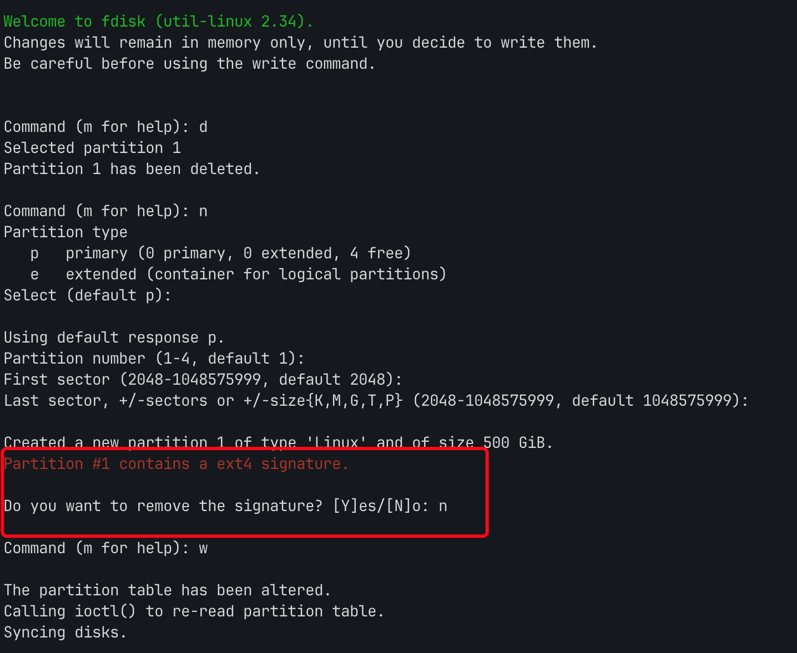
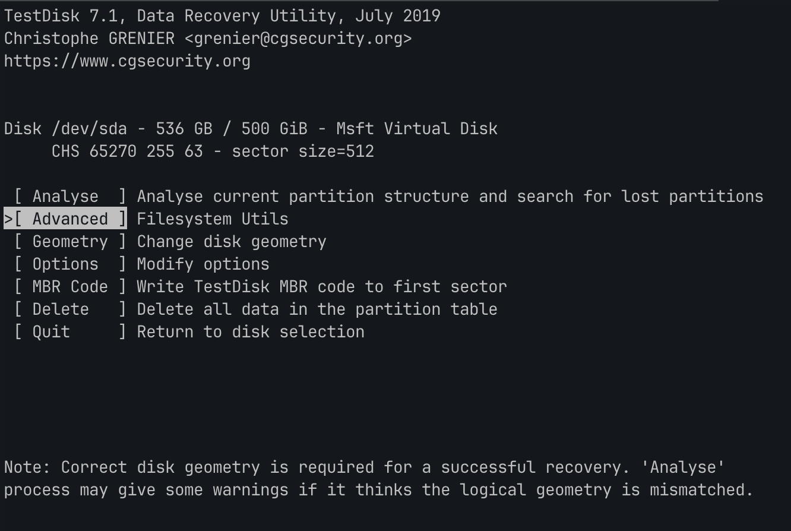
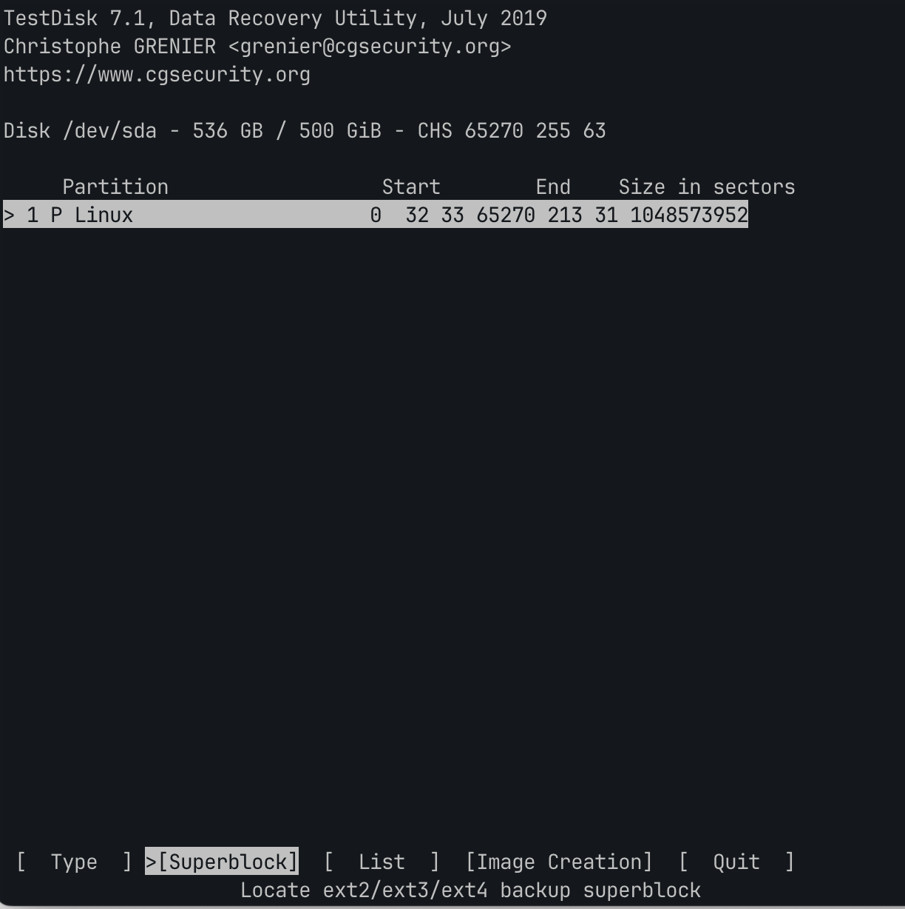
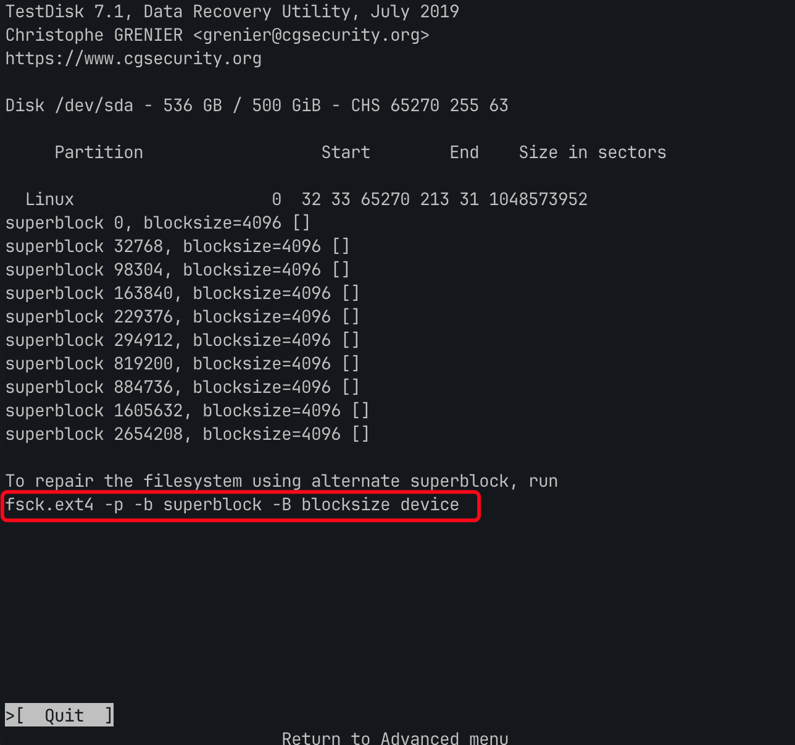
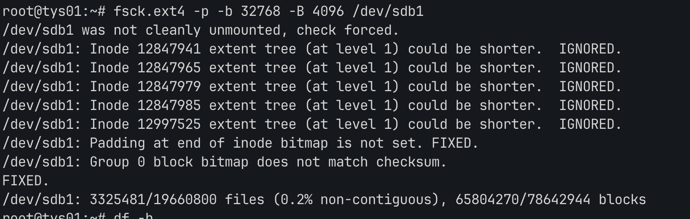

<!--more-->

## 起因

服务器使用hyperv创建了一台虚拟机，早期创建的磁盘大小是300G，但是随着长时间的使用系统磁盘，需要对磁盘进行扩容。hyper-v的磁盘扩容并不算复杂，我参照这了这篇[文章](https://www.linuxprobe.com/hyperv-data-centos7.html)，找到磁盘调整大小并重启后机器即可识别到新的磁盘大小。

## 错误操作

开机使用 lsblk 识别到新的磁盘大小之后就对磁盘开始分区，我这里的磁盘是 /dev/sdb

执行 fdisk  /dev/sdb ，进行了下述操作

1. 删除旧分区
2. 创建新的分区
3. 为新的分区划分全部空间

在划分完新的空间之后，程序提示我: 

```jsx
Partition #1 contains a ext4 signature
```

此时我对这个提示表示疑惑，简单百度资料之后直接选择了删除，结果也就操作了分区数据的丢失。



具体的表现在于：

1. 磁盘无法被正常挂载，提示未知错误（具体的报错没有记录了）
2. 磁盘无法使用`resize2fs` 执行合并

## 补救

### 备份磁盘数据

因为这个磁盘数据已经有300G，磁盘是机械磁盘，因此存有侥幸心里并没有对磁盘进行备份。意识到磁盘可能出问题之后，还是花了2个多小时对磁盘进行了备份，这里我备份的方式是选择通过hyperv管理器新建一个磁盘，选择从已有磁盘还原数据的方式，速度能稳定在50M/s，相比直接备份磁盘文件会快不少。虽然说现在备份已经为时已晚，但是想到后续如果还是要再操作，万一数据错的更离谱，总比什么都没有好。

### 使用 testdisk 进行恢复

查了一圈资料，选择使用 testdisk 进行数据恢复。按照官网的给出的[教程](https://www.cgsecurity.org/wiki/Testdisk_%E6%93%8D%E4%BD%9C%E6%8C%87%E5%8D%97)执行下来，也可以直接阅读阿里云提供的[文档](https://help.aliyun.com/zh/ecs/use-cases/restore-data-in-linux-instances?spm=a2c4g.11186623.0.0.73da249dASt2fn)，情况如下。

* 可以识别到被删除的分区
* 执行分区恢复之后问题依然存在，磁盘不能被挂载。

### 尝试进行Superblock修复

testdisk 除了回恢复分区模式之外，还提供了直接恢复数据的方式，在扫描出分区之后可以直接按 p 列出当前磁盘分区下的文件，我发现我的文件都还在，所以我觉得数据应该还是可以恢复的，只不过是方式不对，加上上一步已经对数据进行了备份，于是就进一步开始尝试恢复的方式。

使用 `testdisk /dev/sdb` 进入数据恢复界面。选择 Advanced



程序列出了识别到的分区，选择 Superblock

> 超级块保存了文件系统设定的文件块大小、操作函数、inode链表等重要信息
>  





可以看到superblock信息被识别出来了，按照程序的提示：如果希望修复文件系统使用备用的超级块，可以执行

```jsx
fsck.ext4 -p -b superblock -B blocksize device
```

但是这个命令只是提示，需要把对应的参数修改为自己的，testdisk 已经显示出当前磁盘的分区superblock信息，替换后执行的命令为：

```jsx
fsck.ext4 -p -b 32768 -B 4096 /dev/sdb1
```

参数解释：

* superblock  指定备用超级块的位置
* blocksize 块大小

命令执行结果如下：



在执行了上述命令之后，磁盘可以被成功挂载了，挂载之后数据也都存在，数据并没有丢失。

## 误删分析

磁盘分区误操作的核心在于这一句提示：

```jsx
Do you want to remove the signature? [Y]es/[N]o: 
```

我选择了 `Y` ，选择移除的话分区的 UUID 会发生变更，也就是一个全新的磁盘，且之前的分区信息（例如分区是什么的格式）都不复存在。所以我在进行挂载的时候会提示我无法识别的分区，此时如果直接对这个磁盘进行格式化然后重新划分分区，也是可以被挂载的，代价就是数据就真的全无了。

## 分区备份

经过这一次操作，再次认识到数据备份的重要性。

使用 **`sfdisk`** 命令备份和还原分区表：
**`sfdisk`** 命令可以用于备份和还原分区表。要备份分区表，执行以下命令：

```bash
sudo sfdisk -d /dev/sdb1 > /path/to/backup/partition_table_backup
```

这会将磁盘 **`/dev/sdb1`** 的分区表信息备份到指定路径的文件中。

要还原备份的分区表，执行以下命令：

```bash
sudo sfdisk /dev/sdb1 < /path/to/backup/partition_table_backup
```

这会将备份的分区表信息还原到磁盘 **`/dev/sdb1`** 上。
