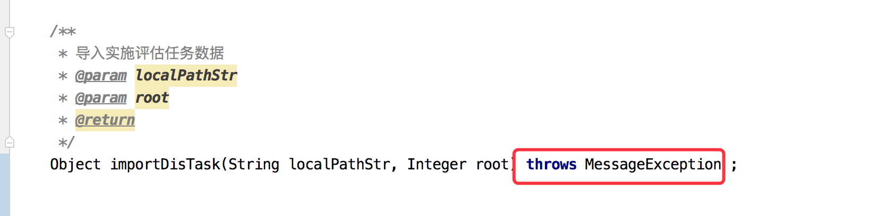

在使用dubbo进行接口调用的时候, 在接口抛出异常的时候会在ExceptionFilter最终抛出异常。

<!--more-->

# Dubbo filter下的异常处理

## 场景

现有的异常处理下, 很多时候我们总是会遇到下面的这个异常

```
com.alibaba.dubbo.rpc.filter.ExceptionFilter invoke xxx
```


那就存在一个问题

我明明自己定义了自定义异常(继承自RuntimeException), 在全局异常处理也做了对应的处理


但是并没有被处理.

## 分析

查看dubboFileter的ExceptionFilter发现:


抛出异常的代码在68行, 查看上下文分析在什么时候会抛出这个异常


## 解决

那么我们想直接返回异常的message给到前端的时候, 根据源码可以制定下面两种方式

1、使用非运行时异常Exception

检查型异常Exception按照常规的方式, 在每一层(domain、seviceImpl、interface层)抛出Exception

但是要注意的是:**在使用非运行时异常的时候, 代码检查工具sonar推荐不要直接Throw Exception, 而是抛出明确的异常来提升代码的可读性.**

2、使用RunTimeException, 但是只在接口层抛出即可

如下:

接口层



实现层, 在实现层不需要专门抛出


效果:


